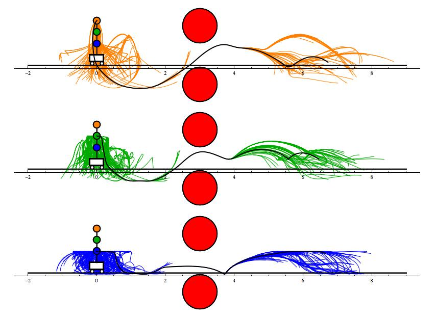
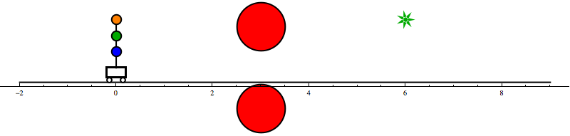
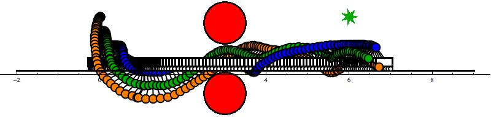

# AgileRRT for 3-Link Pendulum on a Cart
AgileRRT motion plans the highly dynamic 3-link pendulum on a cart. It executes the rapidly exploring random tree using LQR-based steering with linearization about the zero-control trajectory. 

Zero-control steering is presented in caldwell_isrr2015.pdf submitted to ISRR. The code implements Algorithm 4 in the paper, efficient fixed time horizon inexact linear steering, as well as Equation 26, the projection operation.

## Dependencies
Requires GSL Interpolation, Boost odeint, and Eigen.
* [http://www.gnu.org/software/gsl/](http://www.gnu.org/software/gsl/)
* [http://www.boost.org/doc/libs/1_58_0/libs/numeric/odeint/doc/html/index.html](http://www.boost.org/doc/libs/1_58_0/libs/numeric/odeint/doc/html/index.html)
* [http://eigen.tuxfamily.org/](http://eigen.tuxfamily.org/)

## Arguments
Arguments are specified in order. If one is missing, the default value is used (default value given right of '=' sign)
* t_h_max_upper = 1.0       | Max time horizon.
* usezerotraj = true        | Choose linearization for steering: true -> Linearization about zero-control trajectory; false -> Linearization about vertex x0.
* max_cnt = 1000            | Max number of successful insertions into the tree. RRT ends if max_cnt reached.
* max_miss = 1000           | Max number of failed insertions into the tree. RRT ends if max_miss reached.
* max_samplemiss = 10000    | Max number of failed attempts to find a
* numbruns = 1              | Number of runs of the RRT. Run more to get more statistics.
* stopdist = 0.0            | Stops RRT if a point is explored within a ball of radius stopdist from the goal state.
* printskip = 1             | Number of loops of the RRT to skip between printing details to standard out.
* nndelta = LARGENUM        | Nearest Neighbor ball radius for quickly checking
* stats_name = "0"          | Filename to store statistics as a csv. Use "0" or no arg to not make file.
* traj_name = "0"           | Filename to store tree trajectories easily readable by Mathematica. Use "0" or no arg to not make file
* seed = 0                  | To choose the seed to the random number generator

## Example and Visualizations
The triple pendulum on a cart is a highly nonlinear, underactuated dynamic system. The following is an example execution of Agile RRT:
> ./agilerrt 0.75 true 1200 10000 100000 1 .15 30 15 statsname.csv plots.txt 13

This execution has the following arguments:
* t_h_max_upper = 0.75
* usezerotraj = true
* max_cnt = 1200
* max_miss = 10000
* max_samplemiss = 100000
* numbruns = 1
* stopdist = 0.15
* printskip = 30
* nndelta = 15
* stats_name = statsname.csv
* traj_name = plots.txt
* seed = 13

Through the Mathematica file "Agile_RRT_plot.nb", we can plot the results saved in the file plots.txt to see how the execution performed. Note that the RRT successfully explored a point within the stopdist of 0.15 from the goal state. The trajectory that found this point is referred to as the best branch. If a best branch is not found, some of the visualizations are not allowed.

Each of the explored trajectories, as well as the best branch trajectory, are depicted in "exploredtrajs.jpg".

If the best branch is not found, the explored trajectories can still be plotted with the function "PlotAllTraj[]".

A gif animation of the best branch shows the movement of the best trajectory ("animatebestbranchdraws.gif"):

Each frame of the gif can be displayed on top of each other for a nice visualization ("bestbranchdraws.jpg"):

